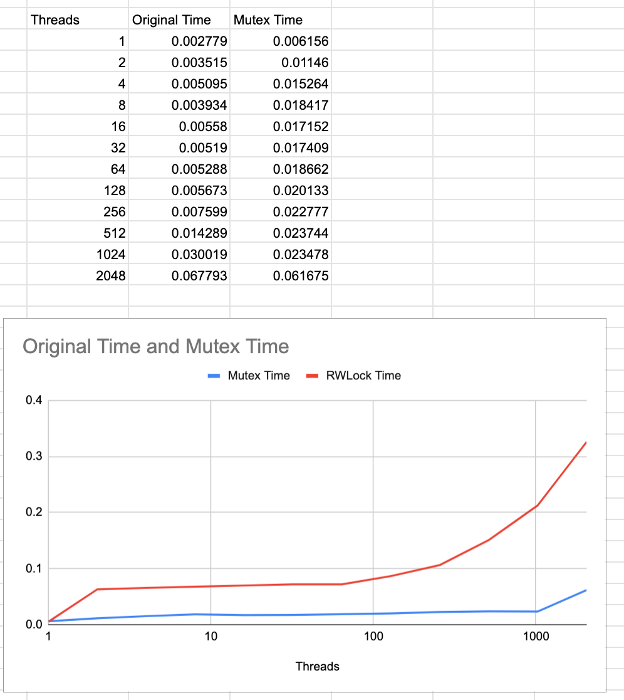
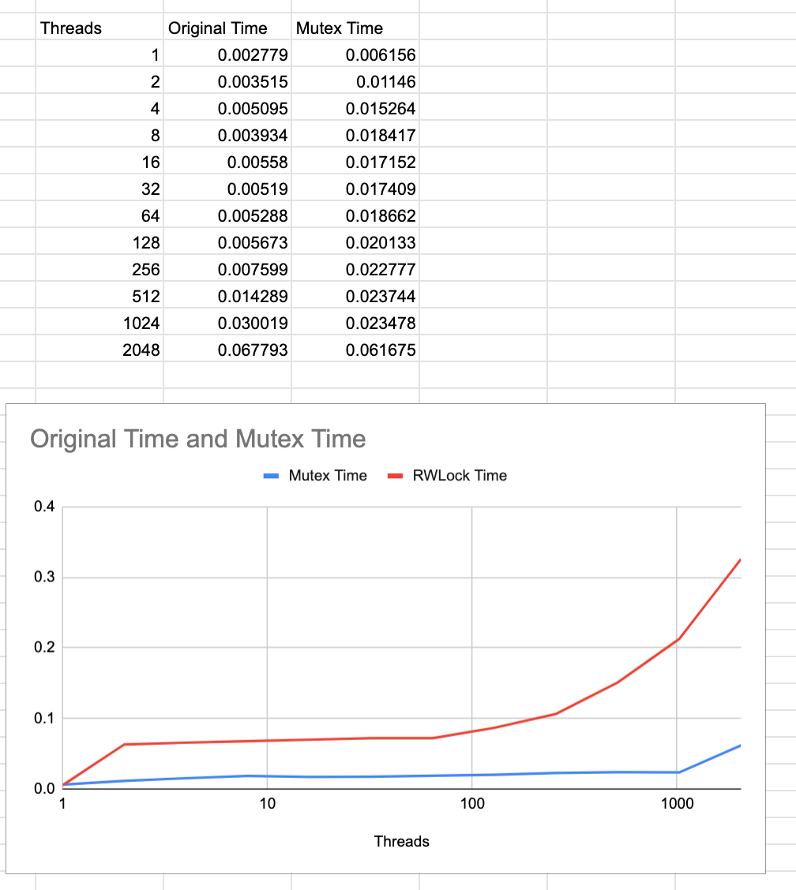
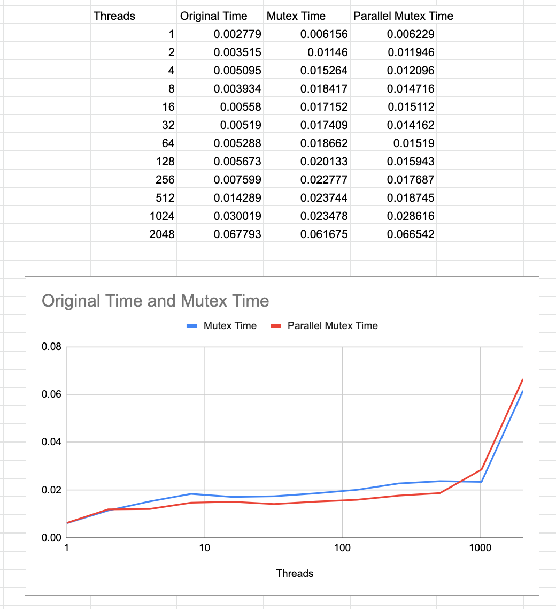

# nyu-os-hw-4-fall22
## Part 2 (there is no part 1) - Mutex

As you can see, adding the mutex configuration adds an relatively large initial increase to the insert time. At most of the measured thread counts, this solution takes about 2-4x as long as the original. Our analysis is pictured below. However this is a worthwhile tradeoff to ensure data fidelity, as the original solution begins to lose keys as soon as there is more than one thread. Without any lock solution the threads write to the same memory, overwriting and dropping keys placed by other threads.

Based on the above, we would estimate that the true additional overhead of the mutex solution is about 3x the original solution.

It is worth noting that retrieval is completely unaltered!

## Part 3 - Spinlocks (Implemented using RWLock module)
MacOS's command line tools don't include the original spinlock implementation (according to some students this is also the case on some Linux distros). Instead, it includes rwlock, which [implements a spinlock for write operations and a counter for read operations](https://www.cs.utexas.edu/~pingali/CS378/2015sp/lectures/Spinlocks%20and%20Read-Write%20Locks.htm). Given that the only operations requiring locks in our parallel hashtable code are write operations, I went ahead and used rwlock instead.

We would expect spinlocks to operate more slowly than mutexes. If a thread hits a mutex lock, it will be put to sleep until woken up, which allows other threads to operate. A thread that hits a spinlock on the other hand will continuously retry until it finally succeeds, which continues consuming CPU resources and doesn't allow another thread to run.

As you can see from our time results below, spinlocks operate much, much more slowly than mutexes- as soon as we have more than one thread they take longer. For 16 threads, this is roughly 10x the time of the mutex implementation!

## Part 4 - Parallel Mutex Retrievals
Retrievals do not require mutex locks in this assignment. As there is no data modification occurring, even if threads read the same address they will return the same key, resulting in no data loss.

It is important to note that this is in a vacuum- if we were to take these pieces of code and implement them in a way where the feedback of retrieval is used for further value modification, then yes, we would want to use a mutex lock at this stage.

Furthermore, the code as given is _already_ retrieving in parallel! If we examine the code, the way bucketing is implemented is by taking the key number and grabbing the modulo of the number of buckets: `key % NUM_BUCKETS`. You can see this is already employed in both the insertion and retrieval code originally provided. Given that a retrieval does not require a mutex lock, there is no additional optimization to be done for this part of the code.

## Part 5 - Parallel Mutex Inserts

We can improve on the performance of the mutex implementation by parallelizing our threads. The original code is kind enough to include buckets already and a helpful hint to use them. So this is exactly what we did, treating the key array as 5 buckets of values and initializing an array of mutex locks to hold one lock for each bucket.

In part 2, we added `pthread_mutex_t mutex` to store our mutex lock. We modify this to be an array of mutex locks `pthread_mutex_t mutex[NUM_BUCKETS]` and consequently alter the insert statement to use the lock for the given bucket instead of the singular lock, and the intialization statement to initialize the full array of locks.

Using the original 5 buckets provided, our parallel implementation produces a modest improvement of about 20% over the regular mutex implementation at most reasonable thread counts.

