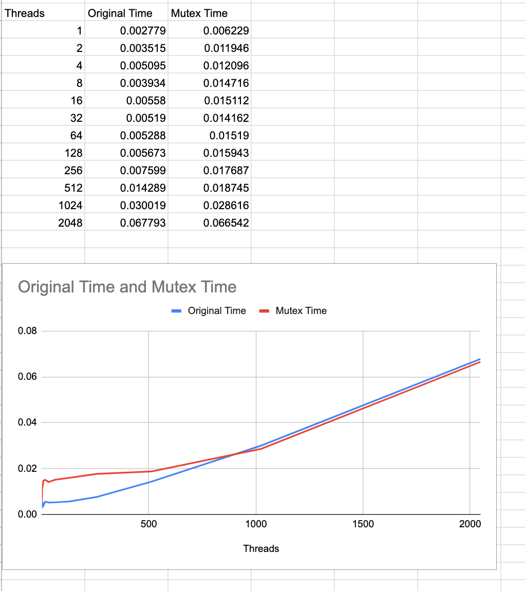
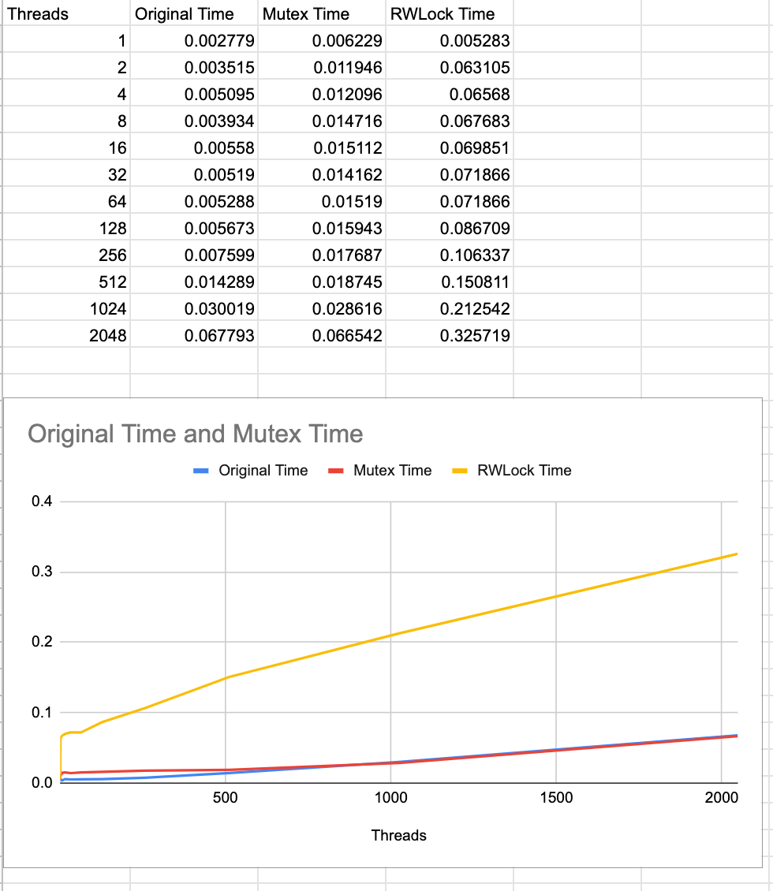

# nyu-os-hw-4-fall22
## Part 2 (there is no part 1) - Mutex

The initial behavior is caused by NEED TO FILL THIS OUT

We see some interesting behavior with regards to time for the original vs the mutex locked version. Adding the mutex configuration adds an relatively large initial increase to the insert time. When thread count is relatively low (under 256) the mutex solution takes about 2-4x as long as the original. However this starts to taper off around 256 threads, before nearly converging somewhere around 800 threads. This is likely due to the investment in threads overtaking the investment in mutex locks, not that the mutex lock solution actually becomes faster. Our analysis is pictured below.

Based on the above, we would estimate that the true additional overhead of the mutex solution is about 3x the original solution.

It is worth noting that retrieval is completely unaltered!

## Part 3 - Spinlocks (Implemented using RWLock module)
MacOS's command line tools don't include the original spinlock implementation, only rwlock, which implements a spinlock for write operations and a counter for read operations. Given that the only operations requiring locks in our parallel hashtable code are write operations, I went ahead and used rwlock instead.

We would expect spinlocks to operate more slowly than mutexes. If a thread hits a mutex lock, it will be put to sleep until woken up, which allows other threads to operate. A thread that hits a spinlock on the other hand will continuously retry until it finally succeeds, which continues consuming CPU resources and doesn't allow another thread to run.

As you can see from our time results below, spinlocks operate much, much more slowly than mutexes- as soon as we have more than one thread they take longer. For 2 threads, this is nearly 20x the time of the original implementation (6x mutexes)

