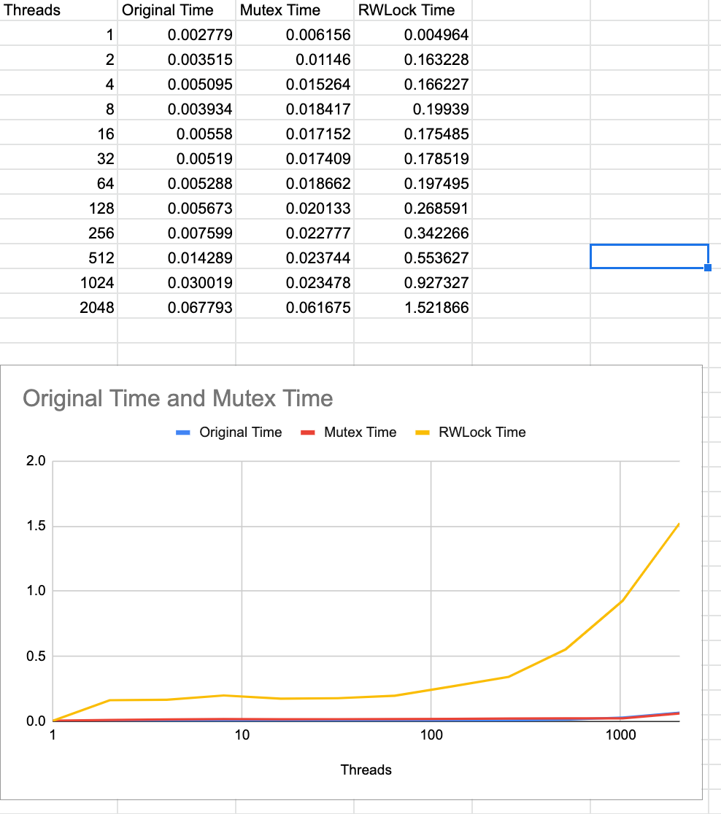

# nyu-os-hw-4-fall22
## Part 2 (there is no part 1) - Mutex

As you can see, adding the mutex configuration adds an relatively large initial increase to the insert time. At most of the measured thread counts, this solution takes about 2-4x as long as the original. Our analysis is pictured below. However this is a worthwhile tradeoff to ensure data fidelity, as the original solution begins to lose keys as soon as there is more than one thread. Without any lock solution the threads write to the same memory, overwriting and dropping keys placed by other threads.

Based on the above, we would estimate that the true additional overhead of the mutex solution is about 3x the original solution.

It is worth noting that retrieval is completely unaltered!

## Part 3 - Spinlocks (Implemented using RWLock module)
MacOS's command line tools don't include the original spinlock implementation (according to some students this is also the case on some Linux distros). Instead, it includes rwlock, which [implements a spinlock for write operations and a counter for read operations](https://www.cs.utexas.edu/~pingali/CS378/2015sp/lectures/Spinlocks%20and%20Read-Write%20Locks.htm). Given that the only operations requiring locks in our parallel hashtable code are write operations, I went ahead and used rwlock instead.

We would expect spinlocks to operate more slowly than mutexes. If a thread hits a mutex lock, it will be put to sleep until woken up, which allows other threads to operate. A thread that hits a spinlock on the other hand will continuously retry until it finally succeeds, which continues consuming CPU resources and doesn't allow another thread to run.

As you can see from our time results below, spinlocks operate much, much more slowly than mutexes- as soon as we have more than one thread they take longer. For 2 threads, this is nearly 20x the time of the original implementation (6x mutexes)

## Part 4 - Parallel Mutex Retrievals

## Part 5 - Parallel Mutex Inserts

We can improve on the performance of the mutex implementation by parallelizing our threads. The original code is kind enough to include buckets already and a helpful hint to use them. So this is exactly what we did, initializing an array of mutex locks over 5 buckets of the key table.

Using the original 5 buckets provided, our parallel implementation produces a modest improvement of about 20% over the regular mutex implementation at most reasonable thread counts.

